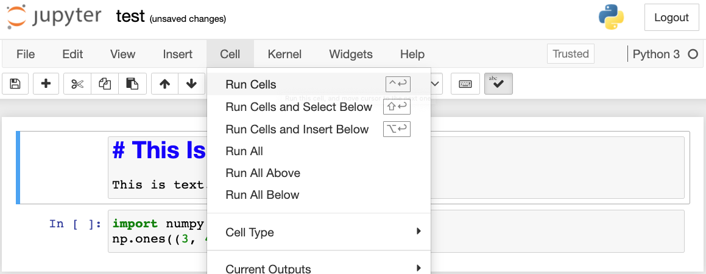
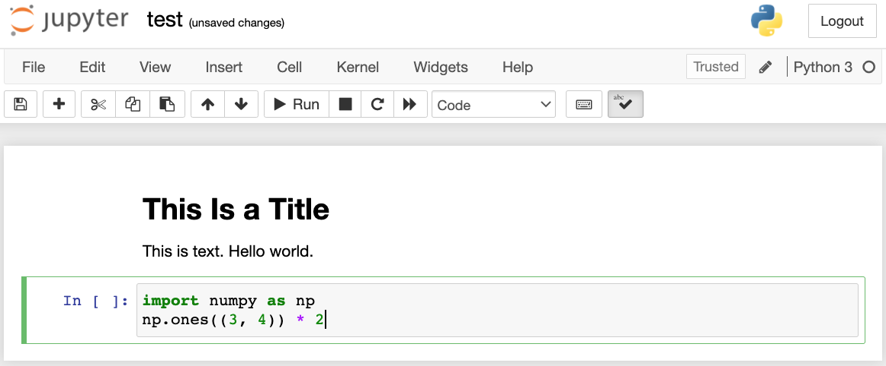

# 使用Jupyter Notebook

本节介绍如何使用Jypyter notebook编辑和运行本书代码。请确保你已按照[“安装和运行”](../chapter_prerequisite/install.md)一节中的步骤安装好Jupyter notebook并获取了本书代码。


## 在本地编辑和运行本书代码

下面我们介绍如何在本地使用Jupyter notebook来编辑和运行本书代码。假设本书代码所在的本地路径为“xx/yy/gluon_tutorials_zh-1.0/”。在命令行模式下进入该路径（`cd xx/yy/gluon_tutorials_zh-1.0`），然后运行命令`jupyter notebook`。这时在浏览器打开 http://localhost:8888 （通常会自动打开）就可以看到Jupyter notebook的界面和本书代码所在的各个文件夹，如图11.1所示。


我们可以通过点击网页上显示的文件夹访问其中的notebook文件。它们的后缀通常是“ipynb”。
为了简洁起见，我们创建一个临时的“test.ipynb”文件，点击后所显示的内容如图11.2所示。该notebook包括了格式化文本单元（markdown cell）和代码单元（code cell）。其中格式化文本单元中的内容包括“这是标题”和“这是一段正文。”。代码单元中包括两行Python代码。


双击格式化文本单元，我们进入了编辑模式。在该单元的末尾添加一段新文本“你好世界。”，如图11.3所示。


如图11.4所示，点击菜单栏的“Cell” $\rightarrow$ “Run Cells”，运行编辑好的单元。




运行完以后，图11.5展示了编辑后的格式化文本单元。


接下来，点击代码单元。在最后一行代码后添加乘以2的操作 `* 2`，如图11.6所示。




我们也可以用快捷键运行单元（默认“Ctrl + Enter”），并得到图11.7中的输出结果。


当一个notebook包含的单元较多时，我们可以点击菜单栏的“Kernel” $\rightarrow$ “Restart & Run All”，以运行整个notebook中的所有单元。点击菜单栏的“Help” $\rightarrow$ “Edit Keyboard Shortcuts”后可以根据自己的喜好编辑快捷键。


## 高级选项

以下是有关使用Jupyter notebook的一些高级选项。你可以根据自己的兴趣参考其中内容。

### 用Jupyter Notebook读写GitHub源文件

如果你希望为本书内容做贡献，需要修改在GitHub上markdown格式的源文件（.md文件非.ipynb文件）。通过notedown插件，我们就可以使用Jupyter notebook修改并运行markdown格式的源代码。Linux/macOS用户可以执行以下命令获得GitHub源文件并激活运行环境。

```bash
git clone https://github.com/mli/gluon-tutorials-zh
cd gluon-tutorials-zh
conda env create -f environment.yml
source activate gluon # Windows 用户运行 activate gluon
```

下面安装notedown插件，运行Jupyter notebook并加载插件：

```bash
pip install https://github.com/mli/notedown/tarball/master
jupyter notebook --NotebookApp.contents_manager_class='notedown.NotedownContentsManager'
```

如果你希望每次运行Jupyter notebook时默认开启notedown插件，可以参考下面步骤。

首先，执行下面命令生成Jupyter notebook配置文件（如果已经生成可以跳过）。

```bash
jupyter notebook --generate-config
```

然后，将下面这一行加入到Jupyter notebook配置文件的末尾（Linux/macOS上一般在`~/.jupyter/jupyter_notebook_config.py`)

```bash
c.NotebookApp.contents_manager_class = 'notedown.NotedownContentsManager'
```

之后，我们只需要运行`jupyter notebook`即可默认开启notedown插件。


### 在远端服务器上运行Jupyter Notebook

有时候，我们希望在远端服务器上运行Jupyter notebook，并通过本地电脑上的浏览器访问。如果本地机器上安装了Linux或者macOS（Windows通过putty等第三方软件也能支持），那么可以使用端口映射：

```bash
ssh myserver -L 8888:localhost:8888
```

以上`myserver`是远端服务器地址。然后我们可以使用 http://localhost:8888 打开运行Jupyter notebook的远端服务器`myserver`。我们将在下一节详细介绍如何在AWS实例上运行Jupyter notebook。

### 运行计时

我们可以通过ExecutionTime插件来对Jupyter notebook的每个代码单元的运行计时。以下是安装该插件的命令。

```bash
pip install jupyter_contrib_nbextensions
jupyter contrib nbextension install --user
jupyter nbextension enable execute_time/ExecuteTime
```

## 小结

* 我们可以使用Jupyter notebook编辑和运行本书代码。

## 练习

* 尝试在本地编辑和运行本书代码。


## 扫码直达[讨论区](https://discuss.gluon.ai/t/topic/6965)


