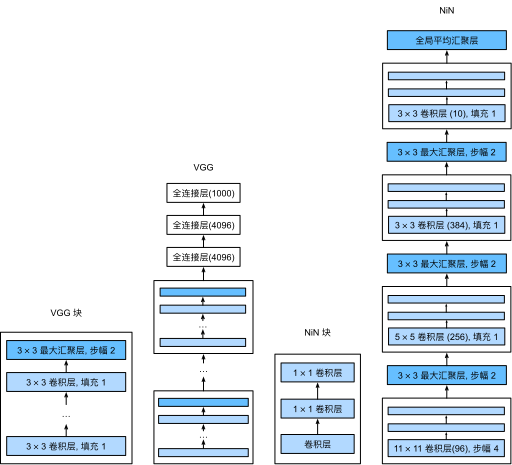

# 网络中的网络 (Nn)
:label:`sec_nin`

Lenet、AlexNet 和 VGG 都有一个共同的设计模式：通过卷积和池化层序列利用 * 空间 * 结构提取要素，然后通过完全连接的图层对表示进行后处理。AlexNet 和 VGG 对 Lenet 的改进主要在于以后这些网络如何扩大和深化这两个模块。或者，人们可以想象在此过程中早期使用完全连接的图层。然而, 不小心地使用密集层可能完全放弃表示的空间结构,
*网络中的网络 * (*NIN*) 块提供了一种替代方案。
他们提出了基于一个非常简单的洞察力：使用 MLP 在每个像素的通道上分别 :cite:`Lin.Chen.Yan.2013`

## Nn 块

回想一下，卷积层的输入和输出由四维张量组成，轴对应于示例、通道、高度和宽度。还要记住，完全连接图层的输入和输出通常是与示例和特征相对应的二维张量。NIn 背后的想法是在每个像素位置（针对每个高度和宽度）应用一个完全连接的图层。如果我们将权重连接到每个空间位置，我们可以将其视为 $1\times 1$ 卷积图层（如 :numref:`sec_channels` 中所述），或作为在每个像素位置上独立作用的完全连接图层。另一种查看方法是将空间维度（高度和宽度）中的每个元素视为等同于示例和通道等效于某个要素。

:numref:`fig_nin` 说明了 VGG 和 NIn 及其区块之间的主要结构差异。NIn 块由一个卷积层组成，后面是两个 $1\times 1$ 卷积图层，这些卷积图层充当每像素完全连接的层，具有 RELU 激活功能。第一层的卷积窗口形状通常由用户设置。随后的窗口形状固定为 $1 \times 1$。


:width:`600px`
:label:`fig_nin`

```{.python .input}
from d2l import mxnet as d2l
from mxnet import np, npx
from mxnet.gluon import nn
npx.set_np()

def nin_block(num_channels, kernel_size, strides, padding):
    blk = nn.Sequential()
    blk.add(nn.Conv2D(num_channels, kernel_size, strides, padding,
                      activation='relu'),
            nn.Conv2D(num_channels, kernel_size=1, activation='relu'),
            nn.Conv2D(num_channels, kernel_size=1, activation='relu'))
    return blk
```

```{.python .input}
#@tab pytorch
from d2l import torch as d2l
import torch
from torch import nn

def nin_block(in_channels, out_channels, kernel_size, strides, padding):
    return nn.Sequential(
        nn.Conv2d(in_channels, out_channels, kernel_size, strides, padding),
        nn.ReLU(),
        nn.Conv2d(out_channels, out_channels, kernel_size=1), nn.ReLU(),
        nn.Conv2d(out_channels, out_channels, kernel_size=1), nn.ReLU())
```

```{.python .input}
#@tab tensorflow
from d2l import tensorflow as d2l
import tensorflow as tf

def nin_block(num_channels, kernel_size, strides, padding):
    return tf.keras.models.Sequential([
        tf.keras.layers.Conv2D(num_channels, kernel_size, strides=strides,
                               padding=padding, activation='relu'),
        tf.keras.layers.Conv2D(num_channels, kernel_size=1,
                               activation='relu'),
        tf.keras.layers.Conv2D(num_channels, kernel_size=1,
                               activation='relu')])
```

## Nn 模型

原来的 NInn 网络是在 AlexNet 后不久提出的，并显然吸引了一些灵感。NIN 使用卷积图层，窗口形状为 $11\times 11$、$5\times 5$ 和 $3\times 3$，输出通道的相应数量与 AlexNet 中的相同。每个 NINn 块后跟一个最大池化层，步幅为 2，窗口形状为 $3\times 3$。

NIn 和 AlexNet 之间的一个显著区别是 NIn 完全避免了完全连接的层。相反，NIN 使用 NIN 块，其输出通道数量等于标注分类的数量，后跟一个 * 全局 * 平均池图层，从而产生一个 login 向量。Nit 设计的一个优点是，它显著减少了所需模型参数的数量。然而，在实践中，这种设计有时需要增加模型训练时间。

```{.python .input}
net = nn.Sequential()
net.add(nin_block(96, kernel_size=11, strides=4, padding=0),
        nn.MaxPool2D(pool_size=3, strides=2),
        nin_block(256, kernel_size=5, strides=1, padding=2),
        nn.MaxPool2D(pool_size=3, strides=2),
        nin_block(384, kernel_size=3, strides=1, padding=1),
        nn.MaxPool2D(pool_size=3, strides=2),
        nn.Dropout(0.5),
        # There are 10 label classes
        nin_block(10, kernel_size=3, strides=1, padding=1),
        # The global average pooling layer automatically sets the window shape
        # to the height and width of the input
        nn.GlobalAvgPool2D(),
        # Transform the four-dimensional output into two-dimensional output
        # with a shape of (batch size, 10)
        nn.Flatten())
```

```{.python .input}
#@tab pytorch
net = nn.Sequential(
    nin_block(1, 96, kernel_size=11, strides=4, padding=0),
    nn.MaxPool2d(3, stride=2),
    nin_block(96, 256, kernel_size=5, strides=1, padding=2),
    nn.MaxPool2d(3, stride=2),
    nin_block(256, 384, kernel_size=3, strides=1, padding=1),
    nn.MaxPool2d(3, stride=2),
    nn.Dropout(0.5),
    # There are 10 label classes
    nin_block(384, 10, kernel_size=3, strides=1, padding=1),
    nn.AdaptiveAvgPool2d((1, 1)),
    # Transform the four-dimensional output into two-dimensional output with a
    # shape of (batch size, 10)
    nn.Flatten())
```

```{.python .input}
#@tab tensorflow
def net():
    return tf.keras.models.Sequential([
        nin_block(96, kernel_size=11, strides=4, padding='valid'),
        tf.keras.layers.MaxPool2D(pool_size=3, strides=2),
        nin_block(256, kernel_size=5, strides=1, padding='same'),
        tf.keras.layers.MaxPool2D(pool_size=3, strides=2),
        nin_block(384, kernel_size=3, strides=1, padding='same'),
        tf.keras.layers.MaxPool2D(pool_size=3, strides=2),
        tf.keras.layers.Dropout(0.5),
        # There are 10 label classes
        nin_block(10, kernel_size=3, strides=1, padding='same'),
        tf.keras.layers.GlobalAveragePooling2D(),
        tf.keras.layers.Reshape((1, 1, 10)),
        # Transform the four-dimensional output into two-dimensional output
        # with a shape of (batch size, 10)
        tf.keras.layers.Flatten(),
        ])
```

我们创建一个数据示例来查看每个块的输出形状。

```{.python .input}
X = np.random.uniform(size=(1, 1, 224, 224))
net.initialize()
for layer in net:
    X = layer(X)
    print(layer.name, 'output shape:\t', X.shape)
```

```{.python .input}
#@tab pytorch
X = torch.rand(size=(1, 1, 224, 224))
for layer in net:
    X = layer(X)
    print(layer.__class__.__name__,'output shape:\t', X.shape)
```

```{.python .input}
#@tab tensorflow
X = tf.random.uniform((1, 224, 224, 1))
for layer in net().layers:
    X = layer(X)
    print(layer.__class__.__name__,'output shape:\t', X.shape)
```

## 培训

和以前一样，我们使用时尚 MNist 来训练模型。NIn 的培训与 AlexNet 和 VGG 的培训相似。

```{.python .input}
#@tab all
lr, num_epochs, batch_size = 0.1, 10, 128
train_iter, test_iter = d2l.load_data_fashion_mnist(batch_size, resize=224)
d2l.train_ch6(net, train_iter, test_iter, num_epochs, lr)
```

## 摘要

* NIn 使用由卷积层和多个 $1\times 1$ 卷积层组成的块。这可以在卷积堆栈中使用，以允许更多的每像素非线性度。
* NIn 删除完全连接的图层，并将它们替换为全局平均池（即在所有位置上进行求和），然后将通道数量减少到所需的输出数量（例如，10 对于 Fashion-MNist）。
* 移除完全连接的层可减少过度拟合。NNn 的参数显著减少。
* NInn 设计影响了许多后续 CNN 设计。

## 练习

1. 调整超参数以提高分类准确性。
1. 为什么 Ny 块中有两个 $1\times 1$ 卷积层？删除其中一个，然后观察和分析实验现象。
1. 计算 NNn 的资源使用情况。
    1. 参数的数量是多少？
    1. 计算量是多少？
    1. 训练期间需要多少内存？
    1. 预测过程中需要的内存量是多少？
1. 通过一步将 $384 \times 5 \times 5$ 表示形式减少到 $10 \times 5 \times 5$ 表示可能存在哪些问题？

:begin_tab:`mxnet`
[Discussions](https://discuss.d2l.ai/t/79)
:end_tab:

:begin_tab:`pytorch`
[Discussions](https://discuss.d2l.ai/t/80)
:end_tab:

:begin_tab:`tensorflow`
[Discussions](https://discuss.d2l.ai/t/332)
:end_tab:
