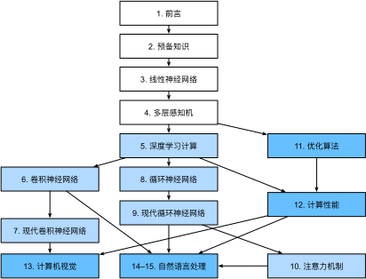

# 如何使用本书

本书将全面介绍深度学习从模型构造到模型训练的方方面面，以及它们在计算机视觉和自然语言处理中的应用。我们将不仅仅阐述算法原理，而且将基于Apache MXNet来演示它们的实现和运行。本书的每一节都是一个Jupyter笔记本，它将文字、公式、图片、代码和运行结果统一在了一起。读者不仅能直接阅读，而且可以运行它们来获得交互式的学习体验。

## 面向的读者

本书面向希望了解深度学习，特别是对实际使用深度学习感兴趣的大学生、工程师和研究人员。本书并不要求你有任何深度学习或者机器学习的背景知识，我们将从头开始解释每一个概念。虽然深度学习技术与应用的阐述涉及了数学和编程，但你只需要对其有一定的了解，例如基础的线性代数、微分和概率，以及基础的Python编程。在附录中我们提供了本书所涉及的数学知识供你参考，如果你之前没有接触过Python，可以参考中文教程 http://www.runoob.com/python/python-tutorial.html 或英文教程 http://learnpython.org/ 。当然，如果你只对书中的数学部分，你可以安全的忽略掉另一半。反之亦然。

## 内容和结构

本书内容大体可以分为三部分：

* 第一部分（第1章至第3章）涵盖预备工作和基础知识。第1章介绍了深度学习的背景和本书的使用。第2章提供了动手学深度学习所需要的预备知识，例如如何获取并运行书中的代码。第3章包括了深度学习最基础的概念和技术，例如多层感知机和模型正则化。如果你时间有限，并且只希望了解深度学习最基础的概念和技术，那么你只需阅读第一部分。

* 第二部分（第4章至第6章）关注现代深度学习技术。第4章描述了深度学习计算的各个重要组成部分，并为之后实现更复杂的模型打下基础。第5章解释了近年来令深度学习在计算机视觉领域大获成功的卷积神经网络。第6章阐述了近年来常用于处理序列数据的循环神经网络。阅读第二部分有助于掌握现代深度学习技术。

* 第三部分（第7章至第10章）讨论计算性能和应用。第7章评价了各种用来训练深度学习模型的优化算法。第8章检验了影响深度学习计算性能的几个重要因素。第9章和第10章分别列举了深度学习在计算机视觉和自然语言处理中的重要应用。这部分内容可供你根据兴趣选择阅读。

图1.1描绘了本书的结构。

## 代码

本书的一大特点是每一节都是可以运行的。你可以改动代码后重新运行来查看其对结果造成的影响。我们认为这种交互式的学习体验对于学习深度学习非常重要。因为深度学习目前并没有很好的理论解释框架，很多论断都是不可描述只能意会。文字解释在这时候很苍白，而且不足以覆盖所有细节。你需要通过不断的改动代码、观察运行结果和总结经验来加深理解并获得领悟。

本书的代码基于Apache MXNet实现。MXNet是一个开源的深度学习框架，它是AWS（亚马逊云计算服务）首选的深度学习框架，也被众多学校和公司使用。本书所有代码已在MXNet 1.2.1下测试通过。但由于深度学习发展极为迅速，未来版本的MXNet可能会造成书中部分代码无法正常运行。遇到类似问题可参考[“安装和运行”](../chapter_prerequisite/install.md)一节来更新代码和运行环境。此外，为避免重复描述，我们将本书多次使用的函数、类等封装在`gluonbook`包中。这些函数、类等的定义所在的章节已在附录中[“gluonbook包索引”](../chapter_appendix/gluonbook.md)里列出。

本书可以作为MXNet入门书使用。但我们提供代码的主要目的在于增加一个在文字、图片和公式外的方式来学习深度学习算法，和一个交互式的环境来理解各个模型和算法在真实数据上的实际效果。我们只使用了MXNet的`autograd`, `ndarray`和`gluon`模块的基础功能，使得你可以尽可能的了解实现细节。即便你研究和工作中是使用其他框架，我们也希望这些代码能帮助你更好的理解深度学习算法。

## 讨论区

本书的学习社区地址是 https://discuss.gluon.ai/ 。当你对书中某节内容有疑惑时，请扫一扫该节后面的二维码参与讨论该节内容。值得一提的是，在有关Kaggle比赛章节的讨论区中，众多社区成员提供了丰富的高水平方法。我们强烈推荐大家积极参与学习社区中的讨论，并相信你一定会有所收获。本书作者和MXNet开发人员也时常参与社区中的讨论。

## 小结

* 我们选择MXNet作为本书使用的深度学习框架。
* 本书力求提供一个多方位交互式的深度学习的学习体验。

## 练习

* 在本书的学习社区 https://discuss.gluon.ai/ 上注册一个账号。搜索关键字Kaggle，浏览其中回复量最大的几个帖子。

## 扫码直达[讨论区](https://discuss.gluon.ai/t/topic/6915)

