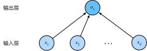

# 线性回归
:label:`sec_linear_regression`

*回归* 是指一类用于建模一个或多个独立变量与依赖变量之间关系的方法。在自然科学和社会科学中，回归最常见的目的是描述输入和输出之间的关系。
另一方面，机器学习通常与*预测*有关。

当我们想预测一个数值时，就会出现回归问题。常见的例子包括预测价格（房屋、股票等）、预测住院时间（针对住院病人）、需求预测（零售销售）等等。不是所有的预测问题都是回归问题。在后面的章节中，我们将介绍分类问题，分类问题的目标是预测一组类别中的对应成员。

## 线性回归的基本元素

*线性回归* 是最简单的也是最流行的回归标准工具。它可以追溯到19世纪初。线性回归基于几个简单的假设。首先，我们假设独立变量 $\mathbf{x}$ 和相关变量 $y$ 之间的关系是线性的，即$y$可以表示为 $\mathbf{x}$ 中元素的加权和，这里考虑到了观测值的一些噪声。其次，我们假设任何噪声都具有良好的表现，如噪声遵循高斯分布。

为了说明这种方法，让我们以一个可以运行的例子开始。如果我们希望根据房屋面积（平方英尺）和房龄（以年为单位）估算房屋价格（以美元为单位）。为了得到一个能真正适合预测房价的模型，我们需要获得一个交易数据集。这个数据集中包括房子的销售价格、面积和房龄。在机器学习的术语中，数据集称为 *训练数据集* 或 *训练集*，每行数据（这里是与一次交易相对应的数据）称为 *样本*（或 *数据点* 、*数据实例*、*例子*）。我们所要试图预测的目标（价格）被称为 *标签*（或 *目标*）。预测所依据的自变量（房龄和面积）称为 *特征*（或 *协变量*）。

通常，我们使用 $n$ 来表示数据集中的样本数量。我们通过 $i$ 对数据点进行索引，输入表示为 $\mathbf{x}^{(i)} = [x_1^{(i)}, x_2^{(i)}]^\top$，与其对应的标签是 $y^{(i)}$。

### 线性模型
:label:`subsec_linear_model`

线性假设是说目标（价格）可以表示为特征（面积和房龄）的加权和：

$$\mathrm{price} = w_{\mathrm{area}} \cdot \mathrm{area} + w_{\mathrm{age}} \cdot \mathrm{age} + b.$$
:eqlabel:`eq_price-area`

在 :eqref:`eq_price-area` 中，$w_{\mathrm{area}}$ 和 $w_{\mathrm{age}}$ 被称为 *权重*，$b$ 被称为 *偏差* （或 *偏移量* 、*截距*）。权重决定了每个特征对我们预测结果的影响。偏差是说，当所有特征都取值为0时，预测值应该为多少。即使现实中不会有任何房子的面积是0，或者房龄正好是0年，我们仍然需要偏差，否则将限制我们的模型的表达能力。严格来说，:eqref:`eq_price-area` 是输入特征的一个 *仿射变换*，其特点是通过加权和对特征进行 *线性变换*，并通过偏差项来结合*平移*。

给定一个数据集，我们的目标是选择权重 $\mathbf{w}$ 和偏差 $b$，使得根据模型做出的预测大体上符合数据中的真实价格。输出预测由输入特征的仿射变换决定的模型为 *线性模型*，其中仿射变换由所选权重和偏差指定。

有些学科通常关注只有少数特征的数据集。在这些学科中，像这样显式地表达长形式的建模是很常见的。而在机器学习领域，我们通常使用的是高维数据集。因此，采用线性代数表示法比较方便。当我们的输入包含 $d$ 个特征时，我们将预测结果 $\hat{y}$（一般来说，“帽子” 符号表示估计值）表示为

$$\hat{y} = w_1  x_1 + ... + w_d  x_d + b.$$

将所有特征放到向量 $\mathbf{x} \in \mathbb{R}^d$ 中，并将所有权重放到向量 $\mathbf{w} \in \mathbb{R}^d$ 中，我们可以使用点积紧凑地表达模型：

$$\hat{y} = \mathbf{w}^\top \mathbf{x} + b.$$
:eqlabel:`eq_linreg-y`

在 :eqref:`eq_linreg-y` 中，向量 $\mathbf{x}$ 对应于单个数据点的特征。通过一个符号表示的矩阵 $\mathbf{X} \in \mathbb{R}^{n \times d}$ 引用我们整个数据集的 $n$ 个样本会很方便。在这里，$\mathbf{X}$ 的每一行是一个样本，每一列是一种特征。

对于特征集合 $\mathbf{X}$ ，预测值 $\hat{\mathbf{y}} \in \mathbb{R}^n$ 可以通过矩阵向量积来表示：

$${\hat{\mathbf{y}}} = \mathbf{X} \mathbf{w} + b,$$

在求和时将应用广播机制 (见 :numref:`subsec_broadcasting`)。

给定训练数据特征 $\mathbf{X}$ 和相应的已知标签 $\mathbf{y}$ ，线性回归的目标是找到权重向量 $\mathbf{w}$ 和偏差项 $b$。我们从$\mathbf{X}$同分布中取样的新数据点。给定采样的新数据点特征，期待新数据点的标签将以最小误差进行预测。

虽然我们相信给定 $\mathbf{x}$ 预测 $y$ 的最佳模型是线性的，但我们很难找到找到一个 $n$ 个样本的真实数据集，其中 $y^{(i)}$ 完全等于 $\mathbf{w}^\top \mathbf{x}^{(i)}+b$。无论我们使用什么手段来观察特征 $\mathbf{X}$ 和标签 $\mathbf{y}$ 都可能会出现少量的观测误差。因此，即使我们确信潜在关系是线性的，我们也会加入一个噪声项来解决这些误差。

在我们开始寻找最好的 *参数*（或 *模型参数*）$\mathbf{w}$ 和 $b$ 之前，我们还需要两个东西：(i) 一种模型质量的度量方式；(ii) 一种能够更新模型以提高模型质量的方法。

### 损失函数

在我们开始考虑如何 *拟合* 模型之前，我们需要确定一个 *适合性* 的度量。*损失函数* 是能够量化目标的 *实际* 与 *预测* 值之间的差异。损失通常为非负数，其中较小的值越好，完美预测的损失为0。回归问题中最常用的损失函数是平方误差。当我们对样本 $i$ 的预测值为 $\hat{y}^{(i)}$，相应的真实标签为 $y^{(i)}$ 时，平方误差可以定义为以下公式：

$$l^{(i)}(\mathbf{w}, b) = \frac{1}{2} \left(\hat{y}^{(i)} - y^{(i)}\right)^2.$$

这个常数$\frac{1}{2}$不会带来本质的差别，但会带来显著的便利，当我们取损失函数的导数的时候就会被消掉。由于训练数据集是给我们的，我们无法控制它。经验误差是关于模型参数的函数。为了进一步说明，来看下面的例子，我们为一维情况的回归问题绘制图像，如 :numref:`fig_fit_linreg` 所示。


:label:`fig_fit_linreg`

由于二次方项，估计值 $\hat{y}^{(i)}$ 和观测值 $y^{(i)}$ 之间较大的差异将贡献更大的损失。为了测量 在整个数据集的模型质量，我们只需计算在训练集$n$ 个样本上的损失均值（也等价于总和）。

$$L(\mathbf{w}, b) =\frac{1}{n}\sum_{i=1}^n l^{(i)}(\mathbf{w}, b) =\frac{1}{n} \sum_{i=1}^n \frac{1}{2}\left(\mathbf{w}^\top \mathbf{x}^{(i)} + b - y^{(i)}\right)^2.$$

在训练模型时，我们希望找到参数 ($\mathbf{w}^*, b^*$)能够最小化在所有训练样本上总损失：

$$\mathbf{w}^*, b^* = \operatorname*{argmin}_{\mathbf{w}, b}\  L(\mathbf{w}, b).$$

### 解析解

线性回归恰好是一个很简单的优化问题。与我们将在本书中所讲到的其他大部分模型不同，线性回归可以用一个简单的公式求得解析解。首先，我们可以将偏差 $b$ 合并到参数 $\mathbf{w}$ 中，方法是在包含所有参数的矩阵中附加一列。我们的预测问题是最小化 $\|\mathbf{y} - \mathbf{X}\mathbf{w}\|^2$。在损失平面上只有一个临界点，它对应于整个区域的损失最小值。将损失相对于$\mathbf{w}$的导数设为0，得到解析（闭合形式）解：

$$\mathbf{w}^* = (\mathbf X^\top \mathbf X)^{-1}\mathbf X^\top \mathbf{y}.$$

像线性回归这样的简单问题存在解析解，但并不是所有的问题都存在解析解。解析解可以进行很好的数学分析，但解析解的限制很严格，导致它排除在了深度学习之外。

### 小批量随机梯度下降

即使在我们无法求得解析解的情况下，我们仍然可以在实践中有效地训练模型。此外，对于许多任务，那些难以优化的模型效果要更好。因此，弄清楚如何训练这些模型是非常重要的。

我们在本书中用到一种名为梯度下降的方法，这种方法可以优化几乎任何深度学习模型。它通过不断更新参数以逐步降低损失函数的方向来减少错误。

梯度下降最朴素的应用是求损失函数的导数，然后计算它在数据集中每个样本损失的平均值。实际上，这可能非常慢：因为在进行一次更新之前，我们必须遍历整个数据集。因此，我们通常会在每次需要计算更新的时候随机抽取一小批样本，这个变体叫做*小批量随机梯度下降*。

在每次迭代中，我们首先随机抽样一个小批量$\mathcal{B}$，它由固定数量的训练样本组成的。然后，我们计算小批量平均损失相对于模型参数的导数（梯度）。最后，我们将梯度乘以一个预先确定的正值$\eta$，并从当前参数值中减去结果项。

我们可以用下面的数学方式表示这一更新过程（$\partial$ 表示偏导数）：

$$(\mathbf{w},b) \leftarrow (\mathbf{w},b) - \frac{\eta}{|\mathcal{B}|} \sum_{i \in \mathcal{B}} \partial_{(\mathbf{w},b)} l^{(i)}(\mathbf{w},b).$$

总而言之，算法的步骤如下：(i) 我们初始化模型参数的值，通常是随机初始化；(ii) 我们从数据中迭代抽取随机的小批量样本，按照负梯度的方向更新参数。对于二次方损失和仿射变换，我们可以明确地写成如下形式:

$$\begin{aligned} \mathbf{w} &\leftarrow \mathbf{w} -   \frac{\eta}{|\mathcal{B}|} \sum_{i \in \mathcal{B}} \partial_{\mathbf{w}} l^{(i)}(\mathbf{w}, b) = \mathbf{w} - \frac{\eta}{|\mathcal{B}|} \sum_{i \in \mathcal{B}} \mathbf{x}^{(i)} \left(\mathbf{w}^\top \mathbf{x}^{(i)} + b - y^{(i)}\right),\\ b &\leftarrow b -  \frac{\eta}{|\mathcal{B}|} \sum_{i \in \mathcal{B}} \partial_b l^{(i)}(\mathbf{w}, b)  = b - \frac{\eta}{|\mathcal{B}|} \sum_{i \in \mathcal{B}} \left(\mathbf{w}^\top \mathbf{x}^{(i)} + b - y^{(i)}\right). \end{aligned}$$
:eqlabel:`eq_linreg_batch_update`

在公式:eqref:`eq_linreg_batch_update`中的$\mathbf{w}$ 和 $\mathbf{x}$ 都是向量。在这里用向量表示比用数学表示更容易理解，比如 $w_1, w_2, \ldots, w_d$。
基数 $|\mathcal{B}|$ 表示每个小批量（*批量大小*）中的样本数，$\eta$ 表示 *学习率*。批量大小和学习率的值是手动预先指定的，通常不是通过模型训练得到的。这些可以调整但不是在训练迭代中更新的参数称为 *超参数*。
*超参数调整* 是选择超参数的过程。超参数通常是我们根据训练迭代结果来调整的，训练迭代结果是在独立的*验证数据集*(*验证集*)上评估得到的。

在训练了若干预先确定的迭代次数后，或者直到满足某些其他停止条件后。我们记录估计的模型参数，表示为$\hat{\mathbf{w}}, \hat{b}$。但是，即使我们的函数是真正线性且没有噪声，这些参数也不会是损失的精确最小值，因为算法会向最小值缓慢收敛，但不能在有限的步数内精确的达到最小值。

线性回归恰好是一个在整个域中只有一个最小值的学习问题。但是，对于更复杂的模型（如深度网络），损失平面包含许多个最小值。幸运的是，由于尚未完全理解的原因，由于一些尚未完全理解的原因，深度学习实践者很少努力寻找能够将 *训练集* 损失最小化的参数。更难的任务是找到一组参数，能够在我们从未见过的数据上，实现低的损失，这一挑战被称为“泛化”。

### 用学习的模型进行预测

给定学习的线性回归模型 $\hat{\mathbf{w}}^\top \mathbf{x} + \hat{b}$，现在我们可以通过给定的房屋面积 $x_1$ 和房龄 $x_2$来估计一个未包含在训练数据中的新房子价格。给定特征估计目标的过程通常称为*预测*或*推理*。

我们将尝试坚持使用*预测*这个词。虽然*推断*这个词已经成为深度学习的标准术语，但这其实有些用词不当。在统计学中，*推断*更多地表示基于数据集估计参数。当深度学习从业者与统计学家交谈时，术语误用经常导致一些误解。

## 向量化可以加速

在训练我们的模型时，我们通常希望同时处理整个小批量的样本。高效地实现这一点需要我们对计算进行向量化并利用快速线性代数库，而不是在Python中编写开销高昂的for循环。

```{.python .input}
%matplotlib inline
from d2l import mxnet as d2l
import math
from mxnet import np
import time
```

```{.python .input}
#@tab pytorch
%matplotlib inline
from d2l import torch as d2l
import math
import torch
import numpy as np
import time
```

```{.python .input}
#@tab tensorflow
%matplotlib inline
from d2l import tensorflow as d2l
import math
import tensorflow as tf
import numpy as np
import time
```

为了说明向量化为什么如此重要，我们考虑两种向量相加的方法。
首先，我们实例化两个全1的1000维向量。在一种方法中，我们将使用Python的for循环遍历向量。在另一种方法中，我们将依赖于对 `+` 的单个调用。

```{.python .input}
#@tab all
n = 10000
a = d2l.ones(n)
b = d2l.ones(n)
```

由于在本书中我们将频繁地对运行时间进行基准测试，所以让我们定义一个计时器。

```{.python .input}
#@tab all
class Timer:  #@save
    """Record multiple running times."""
    def __init__(self):
        self.times = []
        self.start()

    def start(self):
        """Start the timer."""
        self.tik = time.time()

    def stop(self):
        """Stop the timer and record the time in a list."""
        self.times.append(time.time() - self.tik)
        return self.times[-1]

    def avg(self):
        """Return the average time."""
        return sum(self.times) / len(self.times)

    def sum(self):
        """Return the sum of time."""
        return sum(self.times)

    def cumsum(self):
        """Return the accumulated time."""
        return np.array(self.times).cumsum().tolist()
```

现在我们可以对工作负载进行基准测试。

首先，我们使用for循环，每次执行一次加法。


```{.python .input}
#@tab mxnet, pytorch
c = d2l.zeros(n)
timer = Timer()
for i in range(n):
    c[i] = a[i] + b[i]
f'{timer.stop():.5f} sec'
```

```{.python .input}
#@tab tensorflow
c = tf.Variable(d2l.zeros(n))
timer = Timer()
for i in range(n):
    c[i].assign(a[i] + b[i])
f'{timer.stop():.5f} sec'
```

然后，我们使用重载的 `+` 运算符来计算逐元素的和。

```{.python .input}
#@tab all
timer.start()
d = a + b
f'{timer.stop():.5f} sec'
```

第二种方法比第一种方法快得多。向量化代码通常会产生数量级的加速。另外，我们将更多的数学运算放到库中，而无需自己编写那么多的计算，从而减少了出错的可能性。

## 正态分布与平方损失
:label:`subsec_normal_distribution_and_squared_loss`

虽然你已经可以用上面的信息来动手实践了，但接下来，我们可以通过对噪声分布的假设来更正式地说明平方损失目标。

线性回归是高斯于 1795 年发明的，他也发现了正态分布（也称为 *高斯分布*）。正态分布和线性回归之间的联系很深。为了方便您回忆，均值 $\mu$ 和方差 $\sigma^2$（标准差 $\sigma$）的正态分布概率密度如下：

$$p(x) = \frac{1}{\sqrt{2 \pi \sigma^2}} \exp\left(-\frac{1}{2 \sigma^2} (x - \mu)^2\right).$$

下面我们定义了一个Python函数来计算正态分布。

```{.python .input}
#@tab all
def normal(x, mu, sigma):
    p = 1 / math.sqrt(2 * math.pi * sigma**2)
    return p * np.exp(-0.5 / sigma**2 * (x - mu)**2)
```

我们可以看到正态分布。

```{.python .input}
#@tab all
# Use numpy again for visualization
x = np.arange(-7, 7, 0.01)

# Mean and standard deviation pairs
params = [(0, 1), (0, 2), (3, 1)]
d2l.plot(x, [normal(x, mu, sigma) for mu, sigma in params], xlabel='x',
         ylabel='p(x)', figsize=(4.5, 2.5),
         legend=[f'mean {mu}, std {sigma}' for mu, sigma in params])
```

就像我们所看到的，改变均值会产生沿 $x$ 轴的偏移，增加方差会将分散分布，降低其峰值。

利用均方误差损失函数(或简称均方损失)用于线性回归的一个原因是，正式假设观测来自噪声观测，其中噪声服从正态分布。如下式:

$$y = \mathbf{w}^\top \mathbf{x} + b + \epsilon \text{ where } \epsilon \sim \mathcal{N}(0, \sigma^2).$$

因此，我们现在可以写出通过给定的$\mathbf{x}观测到特定$y$的$似然$：

$$P(y \mid \mathbf{x}) = \frac{1}{\sqrt{2 \pi \sigma^2}} \exp\left(-\frac{1}{2 \sigma^2} (y - \mathbf{w}^\top \mathbf{x} - b)^2\right).$$

现在，根据最大似然原理，参数 $\mathbf{w}$ 和 $b$ 的最佳值使整个数据集的*似然*最大的值：

$$P(\mathbf y \mid \mathbf X) = \prod_{i=1}^{n} p(y^{(i)}|\mathbf{x}^{(i)}).$$

根据最大似然原理选择的估计量称为*最大似然估计量*。
虽然使许多指数函数的乘积最大化看起来很困难，但是我们可以在不改变目标的前提下，通过最大化似然对数来显著简化事情。
由于历史原因，优化通常是说最小化而不是最大化。所以，在不改变任何东西的情况下，我们可以 *最小化负对数似然* $-\log P(\mathbf y \mid \mathbf X)$。我们得到的数学公式是：

$$-\log P(\mathbf y \mid \mathbf X) = \sum_{i=1}^n \frac{1}{2} \log(2 \pi \sigma^2) + \frac{1}{2 \sigma^2} \left(y^{(i)} - \mathbf{w}^\top \mathbf{x}^{(i)} - b\right)^2.$$

现在我们只需要假设$\sigma$是某个固定常数，就可以忽略第一项，因为它不依赖于 $\mathbf{w}$和$b$。现在第二项，除了常数$\frac{1}{\sigma^2}$外，其余和前面介绍的平方误差损失是一样的，。
但是，解决方案并不依赖于 $\sigma$。因此，在附加高斯噪声的假设下，最小化均方误差等同于对线性模型的最大似然估计。

## 从线性回归到深度网络

到目前为止，我们只谈论线性模型。
当神经网络涵盖了一个更为丰富的模型家族时，我们可以通过用神经网络的语言来表达线性模型，从而开始把它看作一个神经网络。
首先，让我们以一个“层”符号来重写这些。

### 神经网络图

深度学习从业者喜欢绘制图表来可视化他们的模型中正在发生的事情。
在:numref: ' fig_single_neuron '中，我们将线性回归模型描述为一个神经网络。
需要注意的是，该图只显示连接模式，即只显示每个输入如何连接到输出，隐去了权重或偏差的值。


:label:`fig_single_neuron`

在 :numref:`fig_single_neuron` 所示的神经网络中，输入值为 $x_1, \ldots, x_d$，因此输入图层中的 *输入数*（或 *特征维度*）为 $d$。:numref:`fig_single_neuron` 中网络的输出为$o_1$，因此输出层中的 *输出数* 是 1。需要注意的是，输入值都是*指定的*，只有一个 *计算* 神经元。由于重点在发生计算的地方，所以通常我们在计算层数时不考虑输入层。也就是说，:numref:`fig_single_neuron` 中神经网络的 *层数* 是1。我们可以将线性回归模型视为仅由一个人工神经元组成的神经网络，或者是单层神经网络。

对于线性回归，每个输入都与每个输出相连（在本例中只有一个输出），我们将这种变换（:numref:`fig_single_neuron` 中的输出层）称为 *全连接层（fully-connected layer）* 或 *稠密层（dense layer）*。下一章将详细讨论由这些层组成的网络。

### 生物学

线性回归（1795 年发明）早于计算神经科学，所以将线性回归描述为神经网络似乎不合适。
当控制论者/神经生理学家沃伦·麦库洛奇和沃尔特·皮茨开始开发人工神经元模型时，为什么将线性模型作为一个很自然的起点呢？我们来一张图片：numref:`fig_neuron'，这是一张由*树突*（输入终端）、*核*（CPU）组成的生物神经元的图片。轴突*（输出线）和*轴突端子*（输出端子），通过*突触*与其他神经元连接。


:label:`fig_Neuron`

树突中接收到来自其他神经元（或视网膜等环境传感器）的信息$x_i$。该信息通过*突触权重* $w_i$来加权，以确定输入的影响（例如，通过$x\i w_i$相乘来激活或抑制）。
来自多个源的加权输入以加权和$y = \sum_i x_i w_i + b$的形式聚集在核中，然后将这些信息发送到轴突 $y$ 中进一步处理，通常是通过 $\sigma(y)$ 进行一些非线性处理。

来自其他神经元（或环境传感器，如视网膜）的信息  被收到在树突中。特别是，该信息通过 * 突触重量 * $w_i$ 加权来确定输入的效果（例如，通过产品 $x_i w_i$ 激活或抑制）。来自多个来源的加权输入以加权总和 $y = \sum_i x_i w_i + b$ 的形式聚合在核中，然后将这些信息发送到轴突 $y$ 中进一步处理，通常在通过 $\sigma(y)$ 进行一些非线性处理之后。从那里，它要么到达目的地（例如肌肉），要么通过树突进入另一个神经元。

当然，许多这样的单元可以通过正确的连通性和正确的学习算法拼凑在一起，从而产生比单独一个神经元所能表达的行为更有趣、更复杂，这种高层次的想法归功于我们对真实生物神经系统的研究。

当今大多数深度学习的研究几乎没有直接从神经科学中获得灵感。

我们援引斯图尔特·罗素和彼得·诺维格谁，在他们的经典AI教科书
*Artificial Intelligence: A Modern Approach* :cite:`Russell.Norvig.2016`,
中所说。虽然飞机可能受到鸟类的启发，但几个世纪以来鸟类学并不是航空创新的主要驱动力。同样地，如今在深度学习中的灵感同样或更多地来自数学、统计学和计算机科学。

## 总结

* 机器学习模型中的关键要素是训练数据，损失函数，优化算法，很明显，还有模型本身。
* 向量化使一切更好(主要是数学)和更快(主要是代码)。
* 最小化目标函数和执行最大似然估计等价。
* 线性回归模型也是神经网络。

## 练习

1. 假设我们有一些数据 $x_1, \ldots, x_n \in \mathbb{R}$.我们的目标是找到一个常数$b$，使得最小化 $\sum_i (x_i - b)^2$。
    * 找到最优值 $b$ 的解析解。
    * 这个问题及其解与正态分布有什么关系?
1. 推导出使用平方误差的线性回归优化问题的解析解。为了简化问题，可以忽略偏差$b$(我们可以通过向$\mathbf X$添加所有值为1的一列来做到这一点)。
    * 用矩阵和向量表示法写出优化问题(将所有数据视为单个矩阵，将所有目标值视为单个向量)。
    * 计算损失对$w$的梯度。
    * 通过将梯度设为0、求解矩阵方程来找到解析解。
    * 什么时候可能比使用随机梯度下降更好？这种方法何时会失效？
1. 假定控制附加噪声 $\epsilon$ 的噪声模型是指数分布。也就是说，$p(\epsilon) = \frac{1}{2} \exp(-|\epsilon|)$
    * 写出模型 $-\log P(\mathbf y \mid \mathbf X)$ 下数据的负对数似然。
    * 你能找到一个解析解吗？
    * 提出一种随机梯度下降算法来解决这个问题。哪里可能出错？（提示：当我们不断更新参数时，在驻点附近会发生什么情况）你能解决这个吗？


:begin_tab:`mxnet`
[Discussions](https://discuss.d2l.ai/t/40)
:end_tab:

:begin_tab:`pytorch`
[Discussions](https://discuss.d2l.ai/t/258)
:end_tab:

:begin_tab:`tensorflow`
[Discussions](https://discuss.d2l.ai/t/259)
:end_tab:
