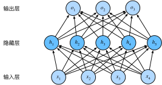

# 多层感知器
:label:`sec_mlp`

在 :numref:`chap_linear` 中，我们引入了 softmax 回归 (:numref:`sec_softmax`)，从头开始实现算法 (:numref:`sec_softmax_scratch`)，并使用高级 API (:numref:`sec_softmax_concise`)，培训分类器从低分辨率图像中识别 10 类服装。一路上，我们学会了如何处理数据，将输出强制为有效的概率分布，应用适当的损失函数，并根据模型的参数最小化。现在我们已经在简单的线性模型的背景下掌握了这些力学，我们可以启动我们对深度神经网络的探索，这是本书主要关注的相对丰富的模型类。

## 隐藏图层

我们在 :numref:`subsec_linear_model` 中描述了仿射变换，这是一种由偏差加入的线性变换。首先，请回想一下与我们的 softmax 回归样本相对应的模型体系结构，如 :numref:`fig_softmaxreg` 所示。该模型通过单个仿射变换，然后进行 softmax 操作，直接将我们的输入映射到我们的输出。如果我们的标注真正通过仿射变换与我们的输入数据相关，那么这种方法就足够了。但仿射变换中的线性度是一个 * 强 * 假设。

### 线性模型可能出错

样本如，线性度意味着 * 单调 * 的 * 较弱 * 假设：我们的特征的任何增加必须始终导致模型输出的增加（如果相应的权重为正值），或者始终导致模型输出的减少（如果相应的权重为负值）。有时这是有道理的。样本如，如果我们试图预测一个人是否会偿还贷款，我们可以合理地想象，保持一切平等，收入较高的申请人总是比收入较低的申请人更有可能偿还。虽然单调，但这种关系可能与偿还的概率并不线性相关。收入从 0 到 5 万的增加可能对应于偿还的可能性大于从 100 万增加到 105 万的增加。处理这个问题的一种方法可能是预处理我们的数据，使线性度变得更加合理，比如说，通过使用收入的对数作为我们的特征。

请注意，我们可以很容易地想出违反单调性的例子。样本，我们希望根据体温预测死亡的概率。对于体温高于 37°C (98.6°F) 的个体，较高的温度表明风险更大。然而，对于体温低于 37°C 的个体，较高的温度表明风险较低！在这种情况下，我们可能会通过一些聪明的预处理来解决问题。也就是说，我们可能会使用 37°C 的距离作为我们的特征。

但是，对猫和狗的图像进行分类呢？在位置（13，17）增加像素的强度是否应该总是增加（或总是减少）图像描绘狗的可能性？对线性模型的依赖与隐含假设相对应，即区分猫与狗的唯一要求是评估单个像素的亮度。在反转图像保留类别的世界中，这种方法注定会失败。

然而，尽管与前面的例子相比，这里的线性度显然很荒谬，但我们可以通过简单的预处理修复来解决这个问题并不明显。这是因为任何像素的重要性以复杂的方式取决于其上下文（周围像素的值）。虽然我们的数据可能存在考虑到我们要素之间的相关交互作用的表线性模型，但我们根本不知道如何手动计算它。对于深度神经网络，我们使用观测数据来共同学习通过隐藏图层的表示形式和对该表示作用的线性预测变量。

### 合并隐藏图层

我们可以克服线性模型的这些限制，并通过合并一个或多个隐藏层来处理更一般的函数类。最简单的方法是将许多完全连接的图层叠在彼此之上。每个图层都会进入其上方的图层，直到我们生成输出。我们可以将前 $L-1$ 图层视为我们的表示形式，最终图层视为我们的线性预测变量。此架构通常称为 * 多层感知器 *，通常缩写为 *MLP*。下面，我们以图形方式描述了一个多功能平台 (:numref:`fig_mlp`)。


:label:`fig_mlp`

该 MLP 有 4 个输入，3 个输出，其隐藏层包含 5 个隐藏单元。由于输入图层不涉及任何计算，因此使用此网络生成输出需要对隐藏图层和输出图层实施计算；因此，此 MLP 中的图层数为 2。请注意，这些图层都完全连接。每个输入都会影响隐藏层中的每个神经元，每个神经元都会影响输出层中的每个神经元。

### 从线性到非线性

和以前一样，通过矩阵 $\mathbf{X} \in \mathbb{R}^{n \times d}$，我们表示一个小批 $n$ 样本，其中每个示例都有 $d$ 输入（功能）。对于隐藏层具有 $h$ 隐藏单位的单隐藏层 MLP，通过 $\mathbf{H} \in \mathbb{R}^{n \times h}$ 表示隐藏层的输出。在这里，$\mathbf{H}$ 也称为 * 隐藏层变量 * 或 * 隐藏变量 *。由于隐藏图层和输出图层都完全连接，我们有隐藏图层权重 $\mathbf{W}^{(1)} \in \mathbb{R}^{d \times h}$ 和偏差 $\mathbf{b}^{(1)} \in \mathbb{R}^{1 \times h}$ 和输出图层权重 $\mathbf{W}^{(2)} \in \mathbb{R}^{h \times q}$ 和偏差 $\mathbf{b}^{(2)} \in \mathbb{R}^{1 \times q}$。形式上，我们计算单隐藏层 MLP 的输出 $\mathbf{O} \in \mathbb{R}^{n \times q}$ 如下：

$$
\begin{aligned}
    \mathbf{H} & = \mathbf{X} \mathbf{W}^{(1)} + \mathbf{b}^{(1)}, \\
    \mathbf{O} & = \mathbf{H}\mathbf{W}^{(2)} + \mathbf{b}^{(2)}.
\end{aligned}
$$

请注意，添加隐藏层后，我们的模型现在要求我们跟踪和更新其他参数集。那么，我们在交换中获得了什么？你可能会惊讶地发现，在上面定义的模型中，* 我们没有为我们的麻烦获得任何东西 *！原因很明显。上面的隐藏单位由输入的仿射函数给出，输出（之前 softmax）只是隐藏单位的仿射函数。仿射函数的仿射函数本身就是仿射函数。此外，我们的线性模型已经能够表示任何仿射函数。

我们可以通过证明对于权重的任何值来正式查看等价，我们可以折叠隐藏层，生成参数 $\mathbf{W} = \mathbf{W}^{(1)}\mathbf{W}^{(2)}$ 和 $\mathbf{b} = \mathbf{b}^{(1)} \mathbf{W}^{(2)} + \mathbf{b}^{(2)}$ 的等效单层模型：

$$
\mathbf{O} = (\mathbf{X} \mathbf{W}^{(1)} + \mathbf{b}^{(1)})\mathbf{W}^{(2)} + \mathbf{b}^{(2)} = \mathbf{X} \mathbf{W}^{(1)}\mathbf{W}^{(2)} + \mathbf{b}^{(1)} \mathbf{W}^{(2)} + \mathbf{b}^{(2)} = \mathbf{X} \mathbf{W} + \mathbf{b}.
$$

为了实现多层架构的潜力，我们需要另外一个关键因素：在仿射变换之后，将非线性 * 激活函数 * $\sigma$ 应用于每个隐藏单元。激活函数（例如 $\sigma(\cdot)$）的输出称为 * 激活 *。一般来说，当激活函数到位后，我们的 MLP 将不再可能折叠为线性模型：

$$
\begin{aligned}
    \mathbf{H} & = \sigma(\mathbf{X} \mathbf{W}^{(1)} + \mathbf{b}^{(1)}), \\
    \mathbf{O} & = \mathbf{H}\mathbf{W}^{(2)} + \mathbf{b}^{(2)}.\\
\end{aligned}
$$

由于 $\mathbf{X}$ 中的每一行对应于微型批处理中的一个样本，并且有些滥用表示法，因此我们定义了非线性 $\sigma$ 以行方式应用于其输入，即一次一个例子。请注意，我们在 :numref:`subsec_softmax_vectorization` 中使用了 oftmax 的表示法相同的方式来表示行操作。通常，如本节所述，我们应用于隐藏图层的激活函数不仅仅是行的，而是从元素角度来看。这意味着在计算图层的线性部分之后，我们可以计算每个激活，而无需查看其他隐藏单位所采取的值。这对于大多数激活功能都是如此。

为了构建更普遍的 MLP，我们可以继续堆叠这样的隐藏图层，例如 $\mathbf{H}^{(1)} = \sigma_1(\mathbf{X} \mathbf{W}^{(1)} + \mathbf{b}^{(1)})$ 和 $\mathbf{H}^{(2)} = \sigma_2(\mathbf{H}^{(1)} \mathbf{W}^{(2)} + \mathbf{b}^{(2)})$，一个在另一个上面，产生更具表现力的模型。

### 通用近似值

MLP 可以通过其隐藏的神经元捕获输入之间的复杂交互，这取决于每个输入的值。我们可以轻松地设计隐藏节点来执行任意计算，实例，对一对输入进行基本逻辑操作。此外，对于激活函数的某些选择，众所周知，MLP 是通用近似值。即使有一个单一的隐藏层网络，给定足够的节点（可能很多）和正确的权重集合，我们也可以建模任何函数，尽管实际上学习这个函数是困难的部分。你可能会认为你的神经网络有点像 C 编程语言。与任何其他现代语言一样，该语言能够表达任何可计算的程序。但实际上想出一个符合您规格的程序是困难的部分。

此外，只是因为单隐藏层网络
** 可以学习任何功能
并不均值您应该尝试使用单隐藏层网络解决所有问题。事实上，我们可以通过使用更深（与更宽）的网络更紧凑地近似许多功能。我们将在以后各章中谈到更严格的论点。

```{.python .input}
%matplotlib inline
from d2l import mxnet as d2l
from mxnet import autograd, np, npx
npx.set_np()
```

```{.python .input}
#@tab pytorch
%matplotlib inline
from d2l import torch as d2l
import torch
```

```{.python .input}
#@tab tensorflow
%matplotlib inline
from d2l import tensorflow as d2l
import tensorflow as tf
```

## 激活函数

激活函数通过计算加权总和并进一步加入偏差来决定是否应激活神经元。它们是将输入信号转换为输出的可差分运算符，而大多数运算符都会增加非线性度。由于激活函数是深度学习的基础，所以让我们简要介绍一些常见的激活函数。

### Relu 函数

由于实现的简单性和在各种预测任务上的良好性能，最流行的选择是 * 整流线性单位 *（* 不愿意 *）。RelU 提供了非常简单的非线性变换。给定一个元素 $x$，函数被定义为该元素的最大值和 $0$：

$$\operatorname{ReLU}(x) = \max(x, 0).$$

非正式地，RelU 函数仅保留正元素，并通过将相应的激活设置为 0 来丢弃所有负元素。为了获得一些直觉，我们可以绘制功能。正如你所看到的，激活函数是分段线性的。

```{.python .input}
x = np.arange(-8.0, 8.0, 0.1)
x.attach_grad()
with autograd.record():
    y = npx.relu(x)
d2l.plot(x, y, 'x', 'relu(x)', figsize=(5, 2.5))
```

```{.python .input}
#@tab pytorch
x = torch.arange(-8.0, 8.0, 0.1, requires_grad=True)
y = torch.relu(x)
d2l.plot(x.detach(), y.detach(), 'x', 'relu(x)', figsize=(5, 2.5))
```

```{.python .input}
#@tab tensorflow
x = tf.Variable(tf.range(-8.0, 8.0, 0.1), dtype=tf.float32)
y = tf.nn.relu(x)
d2l.plot(x.numpy(), y.numpy(), 'x', 'relu(x)', figsize=(5, 2.5))
```

当输入为负值时，RelU 函数的导数为 0，当输入为正值时，RelU 函数的导数为 1。请注意，当输入获取值精确等于 0 时，RelU 函数不可区分。在这些情况下，我们默认使用左侧导数，并说当输入为 0 时，导数为 0。我们可以摆脱这一点，因为输入可能永远不会实际为零。有一个古老的格言，即如果微妙的边界条件重要，我们可能正在做（* 真实 *）数学，而不是工程。这种传统智慧可能适用于这里。我们绘制了下面绘制的 RelU 函数的导数。

```{.python .input}
y.backward()
d2l.plot(x, x.grad, 'x', 'grad of relu', figsize=(5, 2.5))
```

```{.python .input}
#@tab pytorch
y.backward(torch.ones_like(x), retain_graph=True)
d2l.plot(x.detach(), x.grad, 'x', 'grad of relu', figsize=(5, 2.5))
```

```{.python .input}
#@tab tensorflow
with tf.GradientTape() as t:
    y = tf.nn.relu(x)
d2l.plot(x.numpy(), t.gradient(y, x).numpy(), 'x', 'grad of relu',
         figsize=(5, 2.5))
```

使用 RelU 的原因是它的衍生物表现特别好：要么它们消失，要么只是让参数通过。这使得优化更好地表现出来，并缓解了消失困扰以前版本神经网络的渐变的问题（稍后详细介绍）。

请注意，RelU 函数有许多变体，包括 * 参数化的 Relu * 函数（*Prelu*）函数 :cite:`He.Zhang.Ren.ea.2015`。这种变化为 RelU 添加了一个线性项，所以即使参数为负数，仍然有些信息通过：

$$\operatorname{pReLU}(x) = \max(0, x) + \alpha \min(0, x).$$

### 符号函数

* 符号函数 * 将其输入（值位于域 $\mathbb{R}$）转换为位于区间（0，1）上的输出。出于这个原因，sigmoid 通常被称为 * 压缩函数 *：它将范围内的任何输入（-inf，inf）压缩为范围内的某个值（0，1）：

$$\operatorname{sigmoid}(x) = \frac{1}{1 + \exp(-x)}.$$

在最早的神经网络中，科学家们对生物神经元的建模感兴趣，这些神经元无论是 * 火 * 或 * 不火 *。因此，这个领域的先驱，一路回到麦卡洛赫和皮茨，人工神经元的发明者，专注于阈值单元。当其输入低于某个阈值时，阈值激活采用值 0，当输入超过阈值时，阈值激活采用值 1。

当注意力转移到基于梯度的学习时，sigmoid 函数是一个自然的选择，因为它是一个平滑的、可差异的近似阈值单位。当我们想将输出解释为二元分类问题的概率时（您可以将 sigmoid 视为 softmax 的特殊情况），对于输出单位仍然被广泛用作激活函数。然而，sigmoid 主要被更简单和更容易训练的 RELU 所取代，适用于隐藏层中的大多数使用。在后面关于循环神经网络的章节中，我们将介绍一些架构，利用 sigmoid 单元来控制信息跨时间流动。

下面，我们绘制了符号函数。请注意，当输入接近 0 时，sigmoid 函数接近线性变换。

```{.python .input}
with autograd.record():
    y = npx.sigmoid(x)
d2l.plot(x, y, 'x', 'sigmoid(x)', figsize=(5, 2.5))
```

```{.python .input}
#@tab pytorch
y = torch.sigmoid(x)
d2l.plot(x.detach(), y.detach(), 'x', 'sigmoid(x)', figsize=(5, 2.5))
```

```{.python .input}
#@tab tensorflow
y = tf.nn.sigmoid(x)
d2l.plot(x.numpy(), y.numpy(), 'x', 'sigmoid(x)', figsize=(5, 2.5))
```

Sigmoid 函数的导数由以下公式给出：

$$\frac{d}{dx} \operatorname{sigmoid}(x) = \frac{\exp(-x)}{(1 + \exp(-x))^2} = \operatorname{sigmoid}(x)\left(1-\operatorname{sigmoid}(x)\right).$$

西格莫特函数的导数如下图所示。请注意，当输入为 0 时，sigmoid 函数的导数达到最大值 0.25。由于输入在任一方向上从 0 偏离，导数接近 0。

```{.python .input}
y.backward()
d2l.plot(x, x.grad, 'x', 'grad of sigmoid', figsize=(5, 2.5))
```

```{.python .input}
#@tab pytorch
# Clear out previous gradients
x.grad.data.zero_()
y.backward(torch.ones_like(x),retain_graph=True)
d2l.plot(x.detach(), x.grad, 'x', 'grad of sigmoid', figsize=(5, 2.5))
```

```{.python .input}
#@tab tensorflow
with tf.GradientTape() as t:
    y = tf.nn.sigmoid(x)
d2l.plot(x.numpy(), t.gradient(y, x).numpy(), 'x', 'grad of sigmoid',
         figsize=(5, 2.5))
```

### Tanh 函数

与 sigmoid 函数一样，tanh（双曲切线）函数也压缩其输入，将它们转换为-1 和 1 之间的间隔内的元素：

$$\operatorname{tanh}(x) = \frac{1 - \exp(-2x)}{1 + \exp(-2x)}.$$

我们在下面绘制 tanh 函数。请注意，当输入接近 0 时，tanh 函数接近线性变换。虽然函数的形状与 sigmoid 函数的形状相似，但 tanh 函数显示有关坐标系原点的点对称性。

```{.python .input}
with autograd.record():
    y = np.tanh(x)
d2l.plot(x, y, 'x', 'tanh(x)', figsize=(5, 2.5))
```

```{.python .input}
#@tab pytorch
y = torch.tanh(x)
d2l.plot(x.detach(), y.detach(), 'x', 'tanh(x)', figsize=(5, 2.5))
```

```{.python .input}
#@tab tensorflow
y = tf.nn.tanh(x)
d2l.plot(x.numpy(), y.numpy(), 'x', 'tanh(x)', figsize=(5, 2.5))
```

tanh 函数的导数是：

$$\frac{d}{dx} \operatorname{tanh}(x) = 1 - \operatorname{tanh}^2(x).$$

tanh 函数的导数如下图所示。当输入接近 0 时，tanh 函数的导数接近最大值 1。正如我们使用 sigmoid 函数所看到的，当输入在任一方向从 0 移动时，tanh 函数的导数接近 0。

```{.python .input}
y.backward()
d2l.plot(x, x.grad, 'x', 'grad of tanh', figsize=(5, 2.5))
```

```{.python .input}
#@tab pytorch
# Clear out previous gradients.
x.grad.data.zero_()
y.backward(torch.ones_like(x),retain_graph=True)
d2l.plot(x.detach(), x.grad, 'x', 'grad of tanh', figsize=(5, 2.5))
```

```{.python .input}
#@tab tensorflow
with tf.GradientTape() as t:
    y = tf.nn.tanh(x)
d2l.plot(x.numpy(), t.gradient(y, x).numpy(), 'x', 'grad of tanh',
         figsize=(5, 2.5))
```

总之，我们现在知道如何将非线性结合起来构建富有表现力的多层神经网络架构。作为一个方面的说明，你的知识已经使你掌握了一个类似的工具包，大约 1990 年的从业者。在某些方面，你比 1990 年代工作的任何人都有优势，因为你可以利用强大的开源深度学习框架快速构建模型，只需使用几行代码。以前，培训这些网络需要研究人员编写数千行 C 和 Fortran。

## 摘要

* MLP 在输出图层和输入图层之间添加一个或多个完全连接的隐藏图层，并通过激活函数转换隐藏层的输出。
* 常用的激活函数包括 RelU 函数、西格莫图函数和 tanh 函数。

## 练习

1. 计算 PreLu 激活函数的导数。
1. 显示仅使用 RelU（或 PreLu）的 MLP 构建连续分段线性函数。
1. 显示出这样的信息
1. 假设我们有一个非线性，一次应用于一个微型批次。您期望这会导致什么样的问题？

:begin_tab:`mxnet`
[Discussions](https://discuss.d2l.ai/t/90)
:end_tab:

:begin_tab:`pytorch`
[Discussions](https://discuss.d2l.ai/t/91)
:end_tab:

:begin_tab:`tensorflow`
[Discussions](https://discuss.d2l.ai/t/226)
:end_tab:
