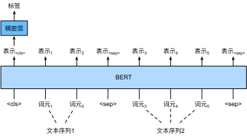

# 针对序列级和令牌级应用程序微调 BERT
:label:`sec_finetuning-bert`

在本章前面的章节中，我们为自然语言处理应用设计了不同的模型，例如基于 RNN、CNN、注意力和 MLP。在空间或时间限制的情况下，这些模型很有用，但是，为每个自然语言处理任务制定一个特定的模型实际上是不可行的。在 :numref:`sec_bert` 中，我们引入了培训前模型 BERT，该模型对于各种自然语言处理任务需要最少的体系结构更改。一方面，在提出提案时，BERT 提高了各种自然语言处理任务的最新状态。另一方面，正如 :numref:`sec_bert-pretraining` 所述，原始 BERT 模型的两个版本有 1.1 亿和 3.4 亿个参数。因此，当有足够的计算资源时，我们可能会考虑为下游自然语言处理应用程序微调 BERT。 

在下文中，我们将一部分自然语言处理应用程序概括为序列级和令牌级。在序列层面，我们介绍如何将文本输入的 BERT 表示形式转换为单个文本分类和文本对分类或回归中的输出标签。在令牌层面，我们将简要介绍新的应用程序，例如文本标记和问答，并阐明 BERT 如何表示他们的输入并转换为输出标签。在微调过程中，BERT 在不同应用程序中要求的 “最小体系结构更改” 是额外的完全连接层。在监督学习下游应用程序期间，从头开始学习额外图层的参数，同时对预训练的 BERT 模型中的所有参数进行了微调。 

## 单个文本分类

*单个文本分类 * 采用单个文本序列作为输入并输出其分类结果。
除了我们在本章中研究的情绪分析之外，语言可接受性语料库 (COLA) 也是单一文本分类的数据集，用于判断给定句子在语法上是否可以接受或不 :cite:`Warstadt.Singh.Bowman.2019`。例如，“我应该学习。” 是可以接受的，但 “我应该学习。” 不是。 

:label:`fig_bert-one-seq`

:numref:`sec_bert` 描述了 BERT 的输入表示形式。BERT 输入序列明确表示单个文本和文本对，其中特殊分类标记 “<cls>” 用于序列分类，特殊分类标记 “<sep>” 标记单个文本的末尾或分隔一对文本。如 :numref:`fig_bert-one-seq` 所示，在单个文本分类应用程序中，特殊分类标记 “<cls>” 的 BERT 表示形式对整个输入文本序列的信息进行编码。作为输入单个文本的表示形式，它将被输入一个由完全连接（密集）图层组成的小型 MLP 中，以输出所有离散标注值的分布。 

## 文本对分类或回归

我们还在本章中研究了自然语言推理。它属于 * 文本对分类 *，一种对文本进行分类的应用程序。 

以一对文本作为输入但输出一个连续值，
*语义文本相似性 * 是一项受欢迎的 * 文本对回归 * 任务。
此任务衡量句子的语义相似性。例如，在语义文本相似性基准测试数据集中，一对句子的相似性分数是从 0（无意义重叠）到 5（意思等价）:cite:`Cer.Diab.Agirre.ea.2017` 的序数分。目标是预测这些分数。语义文本相似性基准数据集中的示例包括（句子 1、第 2 句、相似度分数）： 

* “飞机正在起飞。“，“一架飞机正在起飞。“，5.000;
* “一个女人在吃东西。“，“一个女人在吃肉。“，3.000;
* “一个女人在跳舞。“，“一个男人在说话。“，0.000。

:label:`fig_bert-two-seqs`

与 :numref:`fig_bert-one-seq` 中的单个文本分类相比，:numref:`fig_bert-two-seqs` 中对文本对分类的微调 BERT 在输入表示方式中不同。对于文本对回归任务（如语义文本相似性），可以应用微不足道的更改，例如输出连续标签值和使用均方损失：它们对于回归是常见的。 

## 文本标记

现在让我们考虑令牌级别的任务，例如 * 文本标记 *，其中每个令牌都被分配一个标签。在文本标记任务中，
*语音部分标记 * 为每个单词分配一个语音部分标签（例如形容词和决定词）
根据句子中这个词的作用。例如，根据宾州 Treebank II 标签集，句子 “约翰·史密斯的汽车是新的” 应标记为 “NNP（名词，适当的单数）NNP POS（物主结尾）NN（名词、单数或质量）VB（动词、基本形式）JJ（形容词）”。 

:label:`fig_bert-tagging`

:numref:`fig_bert-tagging` 中说明了针对文本标记应用程序的微调 BERT。与 :numref:`fig_bert-one-seq` 相比，唯一的区别在于在文本标记中，输入文本的 * 每个标记 * 的 BERT 表示形式被输入同一个额外的完全连接的图层中，以输出令牌的标签，例如语音部分标签。 

## 问题回答

作为另一个令牌级应用程序，
*问题答案 * 反映了阅读理解能力。
例如，斯坦福大学问答数据集（Squad v1.1）由阅读段落和问题组成，其中每个问题的答案只是从问题大约为 :cite:`Rajpurkar.Zhang.Lopyrev.ea.2016` 的段落中的一段文本（文本跨度）。为了解释一下，请考虑一句话：“一些专家报告说，口罩的功效尚无确定性。但是，口罩制造商坚持认为他们的产品，例如 N95 呼吸器口罩，可以防御病毒。” 以及一个问题 “谁说 N95 呼吸器口罩可以防御病毒？”。答案应该是段落中的文字跨越 “面具制造商”。因此，Squad v1.1 中的目标是在提出一对问题和段落的情况下，预测段落中文本跨度的开始和结束。 

:label:`fig_bert-qa`

为了微调 BERT 以便回答问题，问题和段落分别作为 BERT 输入的第一和第二个文本序列打包。为了预测文本跨度开始的位置，同一个额外的完全连接图层将将从位置 $i$ 通过的任何令牌的 BERT 表示形式转换为标量分数 $s_i$。通过 softmax 操作进一步转换为概率分布，所有通道令牌的这样的分数，因此，段落中的每个令牌位置 $i$ 都被分配为文本跨度开始的概率 $p_i$。预测文本范围的末尾与上述相同，只是其附加的完全连接图层中的参数与预测开始时的参数独立于预测开始的参数。在预测结束时，位置 $i$ 的任何通道令牌都被同一个完全连接的图层转换为标量分数 $e_i$。:numref:`fig_bert-qa` 描绘了微调 BERT 以便回答问题。 

对于问题回答，受监督学习的训练目标与最大限度地提高地面真相开始和结束位置的对数可能性一样直截了当。在预测跨度时，我们可以计算从位置 $i$ 到位置 $j$（$i \leq j$）的有效跨度的分数 $s_i + e_j$，然后以最高分输出跨度。 

## 摘要

* BERT 对序列级和令牌级自然语言处理应用程序（例如情绪分析和测试语言可接受性）、文本对分类或回归（例如，自然语言）需要极少的体系结构更改（额外的完全连接图层）推理和语义文本相似性）、文本标记（例如，语音部分标记）和问题回答。
* 在监督学习下游应用程序期间，从头开始学习额外图层的参数，同时对预训练的 BERT 模型中的所有参数进行了微调。

## 练习

1. 让我们为新闻文章设计一个搜索引擎算法。当系统收到查询（例如 “冠状病毒爆发期间的石油工业”）时，应返回与查询最相关的新闻文章排名清单。假设我们有大量的新闻文章和大量的查询。为了简化问题，假设每个查询都标记了最相关的文章。我们如何在算法设计中应用负取样（见 :numref:`subsec_negative-sampling`）和 BERT？
1. 我们如何在训练语言模型中利用 BERT？
1. 我们能在机器翻译中利用 BERT 吗？

[Discussions](https://discuss.d2l.ai/t/396)
