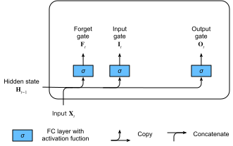
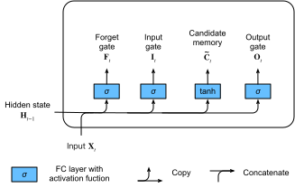
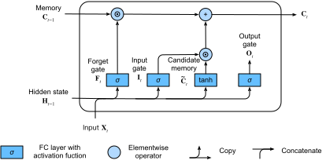
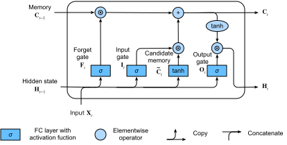

# 长短期记忆（LSTM）


本节将介绍另一种常用的门控循环神经网络：长短期记忆（long short-term memory，简称LSTM）[1]。它比门控循环单元的结构稍微更复杂一点。


## 长短期记忆

LSTM 中引入了三个门：输入门（input gate）、遗忘门（forget gate）和输出门（output gate）；以及与隐藏状态形状相同的记忆细胞（某些文献把记忆细胞当成一种特殊的隐藏状态），从而记录额外的历史信息。


### 输入门、遗忘门和输出门

同门控循环单元中的重置门和更新门一样，如图6.7所示，LSTM的门均由输入为当前时间步输入$\boldsymbol{X}_t$与上一时间步隐藏状态$\boldsymbol{H}_{t-1}$，且激活函数为sigmoid函数的全连接层计算得出。如此一来，这三个门元素的值域均为$[0,1]$。



具体来说，假设隐藏单元个数为$h$，给定时间步$t$的小批量输入$\boldsymbol{X}_t \in \mathbb{R}^{n \times d}$（样本数为$n$，输入个数为$d$）和上一时间步隐藏状态$\boldsymbol{H}_{t-1} \in \mathbb{R}^{n \times h}$。
时间步$t$的输入门$\boldsymbol{I}_t \in \mathbb{R}^{n \times h}$、遗忘门$\boldsymbol{F}_t \in \mathbb{R}^{n \times h}$和输出门$\boldsymbol{O}_t \in \mathbb{R}^{n \times h}$分别计算如下：

$$
\begin{aligned}
\boldsymbol{I}_t &= \sigma(\boldsymbol{X}_t \boldsymbol{W}_{xi} + \boldsymbol{H}_{t-1} \boldsymbol{W}_{hi} + \boldsymbol{b}_i),\\
\boldsymbol{F}_t &= \sigma(\boldsymbol{X}_t \boldsymbol{W}_{xf} + \boldsymbol{H}_{t-1} \boldsymbol{W}_{hf} + \boldsymbol{b}_f),\\
\boldsymbol{O}_t &= \sigma(\boldsymbol{X}_t \boldsymbol{W}_{xo} + \boldsymbol{H}_{t-1} \boldsymbol{W}_{ho} + \boldsymbol{b}_o),
\end{aligned}
$$

其中的$\boldsymbol{W}_{xi}, \boldsymbol{W}_{xf}, \boldsymbol{W}_{xo} \in \mathbb{R}^{d \times h}$和$\boldsymbol{W}_{hi}, \boldsymbol{W}_{hf}, \boldsymbol{W}_{ho} \in \mathbb{R}^{h \times h}$是权重参数，$\boldsymbol{b}_i, \boldsymbol{b}_f, \boldsymbol{b}_o \in \mathbb{R}^{1 \times h}$是偏移参数。激活函数$\sigma$是sigmoid函数。


### 候选记忆细胞

接下来，长短期记忆需要计算候选记忆细胞$\tilde{\boldsymbol{C}}_t$。它的计算同上面介绍的三个门类似，但使用了值域在$[-1, 1]$的tanh函数做激活函数，如图6.8所示。




具体来说，时间步$t$的候选记忆细胞$\tilde{\boldsymbol{C}}_t \in \mathbb{R}^{n \times h}$的计算为

$$\tilde{\boldsymbol{C}}_t = \text{tanh}(\boldsymbol{X}_t \boldsymbol{W}_{xc} + \boldsymbol{H}_{t-1} \boldsymbol{W}_{hc} + \boldsymbol{b}_c),$$

其中的$\boldsymbol{W}_{xc} \in \mathbb{R}^{d \times h}$和$\boldsymbol{W}_{hc} \in \mathbb{R}^{h \times h}$是权重参数，$\boldsymbol{b}_c \in \mathbb{R}^{1 \times h}$是偏移参数。


### 记忆细胞

我们可以通过元素值域在$[0, 1]$的输入门、遗忘门和输出门来控制隐藏状态中信息的流动：这一般也是通过使用按元素乘法（$\odot$）来实现。当前时间步记忆细胞$\boldsymbol{C}_t \in \mathbb{R}^{n \times h}$的计算组合了上一时间步记忆细胞和当前时间步候选记忆细胞的信息，并通过遗忘门和输入门来控制信息的流动：

$$\boldsymbol{C}_t = \boldsymbol{F}_t \odot \boldsymbol{C}_{t-1} + \boldsymbol{I}_t \odot \tilde{\boldsymbol{C}}_t.$$


如图6.9所示，遗忘门控制上一时间步的记忆细胞信息是否传递到当前时间步，而输入门则可以控制当前时间步的输入通过候选记忆细胞流入当前时间步。如果遗忘门一直近似1且输入门一直近似0，过去的记忆细胞将一直通过时间保存并传递至当前时间步。这个设计可以应对循环神经网络中的梯度衰减问题，并更好地捕捉时序数据中间隔较大的依赖关系。




### 隐藏状态

有了记忆细胞以后，接下来我们还可以通过输出门来控制从记忆细胞到隐藏状态$\boldsymbol{H}_t \in \mathbb{R}^{n \times h}$的信息的流动：

$$\boldsymbol{H}_t = \boldsymbol{O}_t \odot \text{tanh}(\boldsymbol{C}_t).$$

这里的tanh函数确保隐藏状态元素值在-1到1之间。需要注意的是，当输出门近似1，记忆细胞信息将传递到隐藏状态供输出层使用；当输出门近似0，记忆细胞信息只自己保留。图6.10展示了长短期记忆中隐藏状态的计算。




## 载入数据集

和前几节中的实验一样，我们依然使用周杰伦歌词数据集来训练模型作词。

```{.python .input  n=1}
import sys
sys.path.insert(0, '..')

import gluonbook as gb
from mxnet import nd
from mxnet.gluon import rnn

(corpus_indices, char_to_idx, idx_to_char,
 vocab_size) = gb.load_data_jay_lyrics()
```

## LSTM的从零开始实现


### 初始化模型参数

以下部分对模型参数进行初始化。超参数`num_hiddens`定义了隐藏单元的个数。

```{.python .input  n=2}
num_inputs = vocab_size
num_hiddens = 256
num_outputs = vocab_size
ctx = gb.try_gpu()

def get_params():    
    def _one(shape):
        return nd.random.normal(scale=0.01, shape=shape, ctx=ctx)
    
    def _three():
        return (_one((num_inputs, num_hiddens)),
                _one((num_hiddens, num_hiddens)),
                nd.zeros(num_hiddens, ctx=ctx)) 
       
    W_xi, W_hi, b_i = _three()  # 输入门参数。
    W_xf, W_hf, b_f = _three()  # 遗忘门参数。
    W_xo, W_ho, b_o = _three()  # 输出门参数。
    W_xc, W_hc, b_c = _three()  # 候选细胞参数。
    # 输出层参数。
    W_hy = _one((num_hiddens, num_outputs))
    b_y = nd.zeros(num_outputs, ctx=ctx)
    # 创建梯度。
    params = [W_xi, W_hi, b_i, W_xf, W_hf, b_f, W_xo, W_ho, b_o, W_xc, W_hc,
              b_c, W_hy, b_y]
    for param in params:
        param.attach_grad()
    return params
```

## 定义模型

LSTM的隐藏状态需要返回额外的形状为（batch_size，num_hiddens）的值为0的记忆细胞。

```{.python .input  n=3}
def init_lstm_state(batch_size, num_hiddens, ctx):
    return (nd.zeros(shape=(batch_size, num_hiddens), ctx=ctx), 
            nd.zeros(shape=(batch_size, num_hiddens), ctx=ctx))
```

根据长短期记忆的计算表达式定义模型。

```{.python .input  n=4}
def lstm(inputs, state, params):
    [W_xi, W_hi, b_i, W_xf, W_hf, b_f, W_xo, W_ho, b_o, W_xc, W_hc, b_c,
     W_hy, b_y] = params
    (H, C) = state
    outputs = []
    for X in inputs:        
        I = nd.sigmoid(nd.dot(X, W_xi) + nd.dot(H, W_hi) + b_i)
        F = nd.sigmoid(nd.dot(X, W_xf) + nd.dot(H, W_hf) + b_f)
        O = nd.sigmoid(nd.dot(X, W_xo) + nd.dot(H, W_ho) + b_o)
        C_tilda = nd.tanh(nd.dot(X, W_xc) + nd.dot(H, W_hc) + b_c)
        C = F * C + I * C_tilda
        H = O * C.tanh()
        Y = nd.dot(H, W_hy) + b_y
        outputs.append(Y)
    return outputs, (H, C)
```

### 训练模型并创作歌词

使用同前一样的超参数。

```{.python .input  n=5}
get_inputs = gb.to_onehot
num_epochs = 160
num_steps = 35
batch_size = 32
lr = 1e2
clipping_theta = 1e-2
prefixes = ['分开', '不分开']
pred_period = 40
pred_len = 50
```

开始模型训练。

```{.python .input}
gb.train_and_predict_rnn(lstm, get_params, init_lstm_state, num_hiddens,
                         vocab_size, ctx, corpus_indices, idx_to_char,
                         char_to_idx, False, num_epochs, num_steps, lr,
                         clipping_theta, batch_size, pred_period, pred_len,
                         prefixes)
```

## LSTM的Gluon实现

我们直接调用rnn包里的LSTM类。

```{.python .input  n=6}
lstm_layer = rnn.LSTM(num_hiddens)
model = gb.RNNModel(lstm_layer, vocab_size)

gb.train_and_predict_rnn_gluon(model, num_hiddens, vocab_size, ctx,
                               corpus_indices, idx_to_char, char_to_idx, 
                               num_epochs, num_steps, lr, clipping_theta,
                               batch_size, pred_period, pred_len, prefixes)
```

## 小结

* 长短期记忆的隐藏层输出包括隐藏状态和记忆细胞。只有隐藏状态会传递进输出层。
* 长短期记忆的输入门、遗忘门和输出门可以控制信息的流动。
* 长短期记忆可以应对循环神经网络中的梯度衰减问题，并更好地捕捉时序数据中间隔较大的依赖关系。


## 练习

* 调调超参数，观察并分析对运行时间、困惑度以及创作歌词的结果造成的影响。
* 在相同条件下，比较长短期记忆、门控循环单元和不带门控的循环神经网络的运行时间。
* 既然候选记忆细胞已通过使用tanh函数确保值域在-1到1之间，为什么隐藏状态还需再次使用tanh函数来确保输出值域在-1到1之间？


## 扫码直达[讨论区](https://discuss.gluon.ai/t/topic/4049)


## 参考文献

[1] Hochreiter, S., & Schmidhuber, J. (1997). Long short-term memory. Neural computation, 9(8), 1735-1780.
